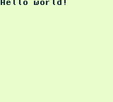

# GameBoy Example 01: Hello World

> Simple program that prints "Hello World" on the screen.

Related article (in French): https://blog.flozz.fr/2019/09/18/developpement-gameboy-1bis-re-hello-world/

Instructions to build this example can be found in [the main README file of this repository](https://github.com/flozz/gameboy-examples/#compiling-examples).
