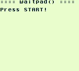

# GameBoy Example 02: Gamepad

> Simple program shows how to use gamepad in a GameBoy program.

Related article (in French): https://blog.flozz.fr/2018/10/15/developpement-gameboy-2-utiliser-le-gamepad/

Instructions to build this example can be found in [the main README file of this repository](https://github.com/flozz/gameboy-examples/#compiling-examples).
