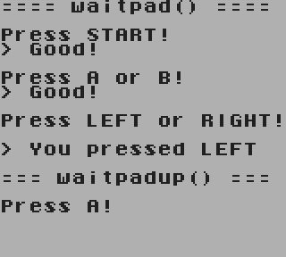

# GameBoy Example 02: Gamepad

> Simple program shows how to use gamepad in a GameBoy program

Related article (in french): TODO

Instructions to build this example can be found in [the main README file of this repository](https://github.com/flozz/gameboy-examples/#compiling-examples).
