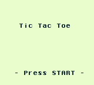

# GameBoy Example 03: Tic Tac Toe

> A complete example project to show how to make a simple game for the GameBoy. This is a text-mode example, there is no graphics yet ;)

Related article (in French): https://blog.flozz.fr/2018/10/29/developpement-gameboy-3-projet-1-tic-tac-toe/

Instructions to build this example can be found in [the main README file of this repository](https://github.com/flozz/gameboy-examples/#compiling-examples).
