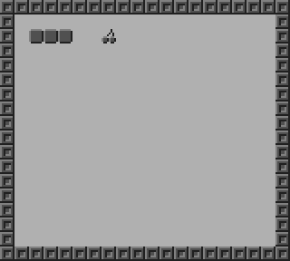

# GameBoy Example 04: Graphics 1

> Simple example to show how to draw tiles on the GameBoy

Related article (in French): https://blog.flozz.fr/2018/11/12/developpement-gameboy-4-afficher-des-images/

Instructions to build this example can be found in [the main README file of this repository](https://github.com/flozz/gameboy-examples/#compiling-examples).
