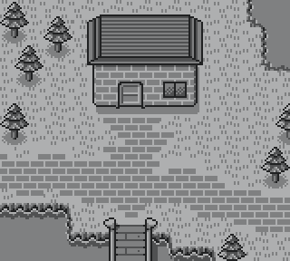

# GameBoy Example 06: Graphics 3 - background

> Background layer with scrolling example

Related article (in French): TODO

Instructions to build this example can be found in [the main README file of this repository](https://github.com/flozz/gameboy-examples/#compiling-examples).

## Image Conversion

In addition to the other build commands documented in the main README file of this repository, I added an other one to regenerate `src/tileset.c` and `src/tileset.h` from `tilemap.png`:

    make tileset

Note that you need to install [img2gb][] >= 0.10.0 to generate the tileset.

[img2gb]: https://github.com/flozz/img2gb
