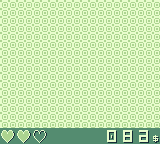

# GameBoy Example 08: Graphics 5 - window

> Window layer example

Related article (in French): https://blog.flozz.fr/2019/06/30/developpement-gameboy-8-la-couche-window/

Instructions to build this example can be found in [the main README file of this repository](https://github.com/flozz/gameboy-examples/#compiling-examples).
