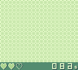

# GameBoy Example 08: Graphics 5 - window

> Window layer example

Related article (in French): https://blog.flozz.fr/2019/06/30/developpement-gameboy-8-la-couche-window/

Instructions to build this example can be found in [the main README file of this repository](https://github.com/flozz/gameboy-examples/#compiling-examples).

## Image Conversion

In addition to the other build commands documented in the main README file of this repository, I added an other one to regenerate `src/tileset.c`, `src/tileset.h`, `src/tileset.png`, `src/tilemap.c` and `src/tilemap.h` from `img.png`:

    make tilemap

Note that you need to install [img2gb][] to generate the tileset and the tilemap.

[img2gb]: https://github.com/flozz/img2gb
