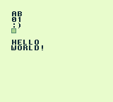

# GameBoy Example 11: Custom Text

> Handle and display text

Related article (in French): https://blog.flozz.fr/2020/10/21/developpement-gameboy-11-gerer-et-afficher-du-texte/

Instructions to build this example can be found in [the main README file of this repository](https://github.com/flozz/gameboy-examples/#compiling-examples).
