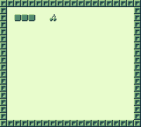
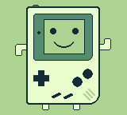
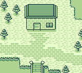
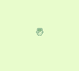
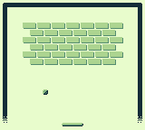

# GameBoy Examples

This repository contains example programs for the Nintendo GameBoy video game console. The examples are related to articles on my blog (in French).


## Examples Index

| Screenshot                                              | Name                                                       | Description                                                                  |
|---------------------------------------------------------|------------------------------------------------------------|------------------------------------------------------------------------------|
|               | [01 - Hello World](./01-hello-world/)                      | Simple program that prints "Hello World" on the screen                       |
|                 | [02 - Gamepad](./02-gamepad/)                              | Simple program shows how to use gamepad in a GameBoy program                 |
|           | [03 - Tic Tac Toe](./03-tic-tac-toe/)                      | A complete example project to show how to make a simple game for the GameBoy |
|             | [04 - Graphics 1](./04-graphics1/)                         | Simple example to show how to draw tiles on the GameBoy                      |
|             | [05 - Graphics 2](./05-graphics2/)                         | Convert an image using img2gb and display it                                 |
|  | [06 - Graphics 3 - background](./06-graphics3-background/) | Background layer scrolling example                                           |
|     | [07 - Graphics 4 - sprites](./07-graphics4-sprites/)       | A complete sprite example with an animated player                            |
|      | [08 - Graphics 5 - window](./08-graphics5-window/)         | Window layer example                                                         |
|     | [09 - Graphics 6 - palettes](./09-graphics6-palette/)      | Playing with color palettes                                                  |
|               | [10 - Breakout](./10-breakout/)                            | Simple breakout game                                                         |
|                | [11 - Custom Text](./11-custom-text/)                      | Handle and display text                                                      |


## Compiling Examples

### Linux

First you need to install some dependencies: SDCC (with its libraries), GNU Make, git. This can be installed with the following command on Debian / Ubuntu:

    sudo apt install build-essential sdcc sdcc-libraries git

Then clone this repository and get submodules:

    git clone https://github.com/flozz/gameboy-examples.git
    cd gameboy-examples
    git submodule init
    git submodule update

Then you have to build the gbdk-n library (this needs to be done only once):

    cd gbdk-n
    make
    cd ..

Finally, you can build examples with the `make` command from the directory of the example. For example, if you want to build the "Hello World" example, you will have to run the following commands:

    cd 01-hello-world/
    make

You can now run the generated `.gb` file with your favorite emulator.

If you want to cleanup the folder from all generated files (`*.rel`, `*.lst`, `*.gb`,...), you can use the following command:

    make clean


### Windows

To build the examples on Windows, you first have to download and install [the latest SDCC version](http://sdcc.sourceforge.net/).

Then clone this repository and get submodules:

    git clone https://github.com/flozz/gameboy-examples.git
    cd gameboy-examples
    git submodule init
    git submodule update

Then you have to build the gbdk-n library (this needs to be done only once).

If you are using CMD.exe:

    cd gbdk-n
    make
    cd ..

If you are using Git Bash:

    cd gbdk-n
    ./Make.bat
    cd ..

Finally go to an example folder:

    cd 01-hello-world

And build it using the `Make.bat` file.

If you are using CMD.exe:

    make

If you are using Git Bash:

    ./Make.bat

You can now run the generated `.gb` file with your favorite emulator.

If you want to cleanup the folder from all generated files (`*.rel`, `*.lst`, `*.gb`,...), you can use the following command:

If you are using CMD.exe:

    make clean

If you are using Git Bash:

    ./Make.bat clean


## Building assets

Some of the examples have assets (tilesets, tilemaps, sprites,...). If you changes the images, you will have to rebuild assets.

### Linux

You will first need to [install img2gb][img2gb-install]. This can be done with the following command:

    sudo pip install img2gb

Then, just run the following command (from the example directory):

    make assets

### Windows

You first have to get the Windows version of img2gb :

* [Download de latest img2gb binary for Windows][img2gb-win],
* then rename it `img2gb.exe`,
* and put it in the project folder (in the same folder than the `Make.bat` file).

Finally, open a terminal in the project's folder and use the following command to rebuild the assets :

    make assets

The previous command will work if you are using CMD.exe, but if you are using Git Bash, type this one instead :

    ./Make.bat assets


[img2gb-win]: https://github.com/flozz/img2gb/releases
[img2gb-install]: https://flozz.github.io/img2gb/install.html


## License

The examples in this repository are licensed under WTFPL unless otherwise stated:

```
        DO WHAT THE FUCK YOU WANT TO PUBLIC LICENSE
                    Version 2, December 2004

 Copyright (C) 2004 Sam Hocevar <sam@hocevar.net>

 Everyone is permitted to copy and distribute verbatim or modified
 copies of this license document, and changing it is allowed as long
 as the name is changed.

            DO WHAT THE FUCK YOU WANT TO PUBLIC LICENSE
   TERMS AND CONDITIONS FOR COPYING, DISTRIBUTION AND MODIFICATION

  0. You just DO WHAT THE FUCK YOU WANT TO.
```
